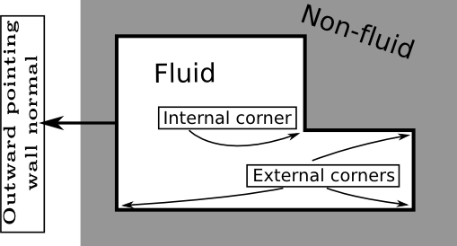

# Defining boundary conditions<div id="DefiningBoundaryConditions"></div>
## Overview
The library Palabos currently implements a bunch of different boundary conditions for straight, grid-aligned boundaries. For general boundaries, the available options include stair-cased walls through bounce-back nodes, and higher-order accurate curved boundaries.

IMPORTANT: Curved boundaries are available as of version 1.0, and are part of a fully-featured parallel stack, including parallel voxelization and I/O extensions. Curved boundaries are not yet documented. You can however find a full-featured example in `showCases/aneurysm`.

## Grid-aligned boundaries
### The class OnLatticeBoundaryConditionXD
Some of the implemented boundary conditions are local (and are therefore implemented as dynamics classes), some are non-local (and are therefore implemented as data processors), and some have both local and non-local components. To offer a uniform interface to the various possibilities, Palabos offers the interface OnLatticeBoundaryConditionXD which is responsible for instantiating dynamics objects, adding data processors, or both, depending on the chosen boundary condition. The following line for example is used to chose a Zou/He boundary condition:

```C++
OnLatticeBoundaryCondition3D<T,DESCRIPTOR>* boundaryCondition =
        createZouHeBoundaryCondition3D<T,DESCRIPTOR>();
```

The four possibilities currently offered are (see palabos.org-bc for details):

- Regularized BC: `createLocalBoundaryConditionXD`
- Skordos BC: `createInterpBoundaryConditionXD`
- Zou/He BC: `createZouHeBoundaryConditionXD`
- Inamuro BC: `createInamuroBoundaryConditionXD`

With each of these boundary conditions, it is possible to implement velocity Dirichlet boundaries (all velocity components have an imposed value) and pressure boundaries (the pressure is imposed, and the tangential velocity components are zero). Furthermore, various types of Neumann boundary conditions are proposed. In these case, a zero-gradient for a given variable is imposed with first-order accuracy by copying the value of this variable from a neighboring cell.

### Boundaries on a regular block domain
The usage of these boundary conditions is somewhat tricky, because Palabos needs to know if a given wall is a straight wall or a corner (2D), or a flat wall, an edge or a corner (3D), and it needs to know the wall orientation. To simplify this, all `OnLatticeBoundaryConditionXD` objects have a method `setVelocityConditionOnBlockBoundaries` and a method `setPressureConditionOnBlockBoundaries`, to set up boundaries which are located on a rectangular domain. If all nodes on the boundary of a given 2D box `boundaryBox` implement a Dirichlet condition, use the following command:

```C++
Box2D boundaryBox(x0,x1, y0,y1);
boundaryCondition->setVelocityConditionOnBlockBoundaries (
                           lattice, boundaryBox, locationOfBoundaryNodes );
```

The first argument indicates the boxed shape on which the boundary is located, and the second argument specifies on which node a velocity condition is to be instantiated. If all boundary nodes are located on the exterior bounding box of the lattice, the above command simply becomes:

```C++
boundaryCondition->setVelocityConditionOnBlockBoundaries(lattice, locationOfBoundaryNodes);
```

Finally, if simply all nodes of the exterior bounding box shall implement a velocity condition, this simplifies to:

```C++
boundaryCondition->setVelocityConditionOnBlockBoundaries(lattice);
```

Now, suppose that the upper and lower walls, including corners, in a `nx` -by- `ny` lattice implement a free-slip condition (zero-gradient for tangential velocity components), the left wall a Dirichlet condition, and the right wall and outflow condition (zero-gradient for all velocity components). This is achieved by adding one more parameter to the function call:

```C++
Box2D inlet(0, 0, 2, ny-2);
Box2D outlet(nx-1, nx-1, 2, ny-2);
Box2D bottomWall(0, nx-1, 0, 0);
Box2D topWall(0, nx-1, ny-1, ny-1);

boundaryCondition->setVelocityConditionOnBlockBoundaries ( lattice, inlet );
boundaryCondition->setVelocityConditionOnBlockBoundaries (
                               lattice, outlet, boundary::outflow );
boundaryCondition->setVelocityConditionOnBlockBoundaries (
                               lattice, bottomWall, boundary::freeslip );
boundaryCondition->setVelocityConditionOnBlockBoundaries (
                               lattice, topWall, boundary::freeslip );
```

Remember that if the boundary is not located on the outer bounds of the lattice, you must use an additional Box3D argument to say where the boundaries are located, additionally to saying which boundary is going to be added. This is necessary, because Palabos needs to know the orientation and the nature (flat wall, corner, etc.) of the boundary nodes.

### Zero-gradient conditions
The optional arguments like `boundary::outflow` are of type `boundary::BcType`, and can have the following values for velocity boundaries:

|   |    |
|------|-------|
|boundary::dirichlet (default value)|	Dirichlet condition: imposed velocity value.|
|boundary::outflow or boundary::neumann|	Zero-gradient for all velocity components.|
|boundary::freeslip	|Zero-gradient for tangential velocity components, zero value for the others.|
|boundary::normalOutflow	|Zero-gradient for normal velocity components, zero value for the others.|

For pressure boundaries, you have the following choice:

|   |    |
|-----------|-----------|
|boundary::dirichlet (default value)|	Dirichlet condition: imposed pressure value, zero value for the tangential velocity components.|
|boundary::neumann|	Zero-gradient for the pressure, zero value for the tangential velocity components.|

**Boundary conditions cannot be overriden**: It is not possible to override the type of a boundary. Once a boundary node is a Dirichlet velocity node, it stays a Dirichlet velocity node. The result of re-defining it as, say, a pressure boundary node, is undefined. Therefore, boundary conditions must be defined carefully, and piece-wise, as shown in the example above. On the other hand, the value imposed on the boundary (i.e. the velocity value on a Dirichlet velocity boundary) can be changed as often as needed.

### Setting the velocity or pressure value on Dirichlet boundaries
A constant velocity value is imposed with the function `setBoundaryVelocity`. The following line sets the velocity values to zero on all nodes of a 2D domain which have previously been defined to be Dirichlet velocity nodes:

```C++
setBoundaryVelocity(lattice, lattice.getBoundingBox(), Array<T,2>(0.,0.) );
```

On all other nodes, this command has no effect. To set a constant pressure value (or equivalently, density value), use the command `setBoundaryDensity`:

```C++
setBoundaryDensity(lattice, lattice.getBoundingBox(), 1. );
```

A non-constant, space dependent velocity resp. pressure profile can be defined by replacing the velocity resp. pressure argument by either a function or by a function object (an instance of a class which overrides the function call operator) which yields a value of the velocity resp. density as a function of space position. An example is provided in the file `examples/showCases/poiseuille/poiseuille.cpp`.

### Interior and exterior boundaries
Sometimes, the boundary is not located on the surface of a regular, block-shaped domain. In this case, the functions like `setVelocityConditionOnBlockBoundaries` are useless, and the boundary must be manually constructed. As an example, here’s how to construct manually a free-slip condition along the top-wall, including the corner nodes:

```C++
// The automatic creation of a top-wall ...
Box2D topWall(0, nx-1, ny-1, ny-1);
boundaryCondition->setVelocityConditionOnBlockBoundaries (
                               topWall, lattice, boundary::freeslip );

// ... can be replaced by a manual construction as follows:
Box2D topLid(1, nx-2, ny-1, ny-1);
boundaryCondition->addVelocityBoundary1P( topLid, lattice, boundary::freeslip );
boundaryCondition->addExternalVelocityCornerNP( 0, ny-1, lattice, boundary::freeslip );
boundaryCondition->addExternalVelocityCornerPP( nx-1, ny-1, lattice, boundary::freeslip );
```

A distinction is made between external and internal corners, depending on whether the corner is convex or concave. On the following example geometry, you’ll find five external and one internal corner:



The extensions like `1P`, ``NP`, and `PP` at the end of the methods of the boundary-condition object are used to indicate the orientation of the wall normal, pointing outside the fluid domain, as shown on the figure above. On a straight wall, the code `1P` means: “the wall normal points into positive y-direction”. Likewise, the inlet would be labeled with the code `0N` as in “negative x-direction”. On a corner, the code `NP` means “negative x-direction and positive y-direction”. It is important to mention that this wall normal is purely geometrical and does not depend on whether a given wall has the function of an inlet or an outlet. In both cases, the wall normal points away from the fluid, into the non-fluid area.

In 3D, you’ll use the following function for plane walls:

```C++
addVelocityBoundaryDO
```

where the direction D can be 0 for x, 1 for y, or 2 for z, and the orientation `O` has the value `P` for positive and `N` for negative. Edges can be internal or external. For example:

```C++
addInternalVelocityEdge0NP
addExternalVelocityEdge1PN
```

where the first digit of the code indicates the axis to which the edge is parallel, and the two subsequent digits indicate the orientation of the edge inside the plane normal to the edge, in the same way as the corner nodes in 2D. The axes are counted periodically: `0NP` means x-plane, negative y-value, and positive z-value, whereas `1PN` means y-plane, positive z-value, and negative x-value. Finally, 3D corners are constructed in the same way as in 2D, through a function call like the following:

```C++
addInternalVelocityCornerPNP
addExternalVelocityCornerNNN
```

## Periodic boundaries
The concept of periodicity in Palabos is different from the approach chosen for the other types of boundary conditions. Periodicity can only be implemented on opposite, outer boundaries of an atomic-block or a multi-block. This behavior works also if the multi-block has a sparse memory implementation. In this case, all fluid nodes which are in contact with an outer boundary of the multi-block can be periodic, if the corresponding node on the opposite wall is a fluid node.

In the case of an atomic-block (remember that this case is uninteresting, because you should always work with multi-blocks anyway), periodicity is simply a property of the streaming operator. It has no effect for scalar-fields and tensor-fields. In the case of a multi-block however, periodicity can also affect scalar-fields and tensor-fields. Being periodic in this case means that if you define a non-local data processors which accesses nearest neighbor nodes, the value of these neighbor nodes is determined by periodicity along an outer boundary of the multi-block.

By default, all blocks are non-periodic: as mentioned previously, the behavior of outer boundary nodes defaults to one of the versions of bounce-back algorithm. To turn on periodicity along, say, the x-direction, write a command like

```C++
lattice.periodicity.toggle(0, true);  // Periodic block-lattice.
scalarField.periodicity.toggle(0, true);  // Periodic scalar-field.
```

You can also define all boundaries to be periodic through a single command:

```C++
lattice.periodicity.toggleAll(true);
```

Please note that the periodicity or non-periodicity of a block should be defined as soon as possible after the creation of the block, because Palabos needs to know if boundaries are periodic or not when adding or executing data processors.

As a last remark, you should be aware that boundaries of Neumann type (outflow, free-slip, adiabatic thermal wall, etc.) should never be defined to be periodic. This wouldn’t make sense anyway, and it leads to an undefined behavior (aka the program crashes).

## Bounce-back
In Palabos, all outer boundaries of a lattice which are not periodic automatically implement a version of the bounce-back boundary algorithm, according to the following algorithm. In pre-collision state, all unknown populations are assigned the post-collision value on the same node at the end of the previous iteration, from the opposite location. We will call this algorithm `Bounce-Back 1`.

A bounce-back condition can also be used elsewhere in the domain, by explicitly assigning a dynamics object of type `BounceBack<T,Descriptor>` to chosen cells. On these newly assigned nodes, the collision step is replaced by a bounce-back procedure, during which each population is replaced by the population corresponding to the opposite direction. Such a node can not be considered any more as a fluid node. Computing velocity-moments of the populations on a bounce-back node yields for example arbitrary results, because some of the populations (those which are not incoming from the fluid) have arbitrary values. Consequently, you cannot compute macroscopic quantities like density and velocity on these nodes. Instead, these nodes should be considered as pure algorithmic entities which have the purpose to re-inject into the fluid all populations that leave the domain. Consider fluid nodes adjacent to this type of bounce-back cells. If you think about it, you’ll realize that these nodes behave exactly as if they were cells of type `Bounce-Back 1`, with a small difference: unknown populations at time `t` get the post-collision value from opposite populations from time `t-2` (and not time `t-1` as in `Bounce-Back 1`. We will refer to this version of bounce-back as `Bounce-Back 2`.

The effect of both versions of bounce-back is to produce a no-slip wall located half-way between nodes. In the case of `Bounce-Back 1`, this is half a cell-width beyond the bounce-back fluid cell, whereas in the case of `Bounce-Back 2` it is half-way between the last fluid cell and the non-fluid bounce-back node. Obviously, `Bounce-Back 2` wastes numerical precision over `Bounce-Back 1` by leaping over a time step, and therefore leads to a lower-order accuracy in time of the numerical method. Furthermore, both versions of bounce-back represent the wall location through a staircase approximation, which is low-order accurate (“Order-h”) in space. On the other hand, `Bounce-Back 2` offers a huge advantage: its implementation is independent of the wall orientation. If you decide that a node is a bounce-back node, you simply say so; no need to know if it is a corner, a left wall, or a right wall. Constructing a geometry is then as easy as filling areas with bounce-back nodes. In many cases, this ease of use makes up, to a large extent, for the low-order accuracy of the wall representation. When setting up a new simulation, it is always good to try `Bounce-Back 2` as a first attempt, as the quality of the obtained results is often surprising. In highly complex geometry such as porous media, bounce-back is often even considered superior to other approaches.

### Bounce-back domain from analytical description
The *Rule 0* in Palabos can be stated often enough: don’t write loops over space in end-user code. This also true, of course, when assigning bounce-back dynamics to lattice cells. To guarantee reasonable performance, this is task is performed inside a data processor, or even better, by using the wrapper function `defineDynamics`. This process is illustrated in the example program `examples/codesByTopic/bounceBack/instantiateCylinder.cpp`. First, a class is written which defines the location of the bounce-back nodes as a function of the cell coordinates iX and iY. In the present case, the nodes are located inside a 2D circular domain:

```C++
template<typename T>
class CylinderShapeDomain2D : public DomainFunctional2D {
public:
    CylinderShapeDomain2D(plint cx_, plint cy_, plint radius)
        : cx(cx_),
          cy(cy_),
          radiusSqr(util::sqr(radius))
    { }
    // The function-call operator is overridden to specify the location
    //   of bounce-back nodes.
    virtual bool operator() (plint iX, plint iY) const {
        return util::sqr(iX-cx) + util::sqr(iY-cy) <= radiusSqr;
    }
    virtual CylinderShapeDomain2D<T>* clone() const {
        return new CylinderShapeDomain2D<T>(*this);
    }
private:
    plint cx, cy;
    plint radiusSqr;
};
```

An instance of this class is then provided as an argument to `defineDynamics`:

```C++
defineDynamics( lattice, lattice.getBoundingBox(),
                new CylinderShapeDomain2D<T>(cx, cy, radius),
                new BounceBack<T,DESCRIPTOR> );
```

The second argument is of type Box2D, and it can be used to improve the efficiency of this function call: the bounce-back nodes are attributed on cells on the intersection between this box and the domain specified by the domain-functional.

If your domain is specified as the union of a collection of simpler domains, you can use `defineDynamics` iteratively on each of the simpler domains. If the domain is the intersection or any other geometric operation of simpler domains, you’ll need to play with boolean operators inside the definition of your domain-functional.

### Bounce-back domain from boolean mask
In this section, it is assumed that the geometry of the domain is prescribed from an external source. This is for example the case when you simulate a porous media and possess data from a scan of the porous material in question. This easiest approach consists in storing this data as an ASCII file which distinguishes fluid nodes from solid nodes by zeros and ones, separated with spaces, tabs, or newline characters. The file represents the content of a regular array and stores only raw data, no information on the matrix dimensions. The data layout must be the same as in Palabos: an increment of the z-coordinate represents a continuous progress in the file (in 3D), followed by the y-coordinate, and then the x-coordinate. This data is simply flushed from the file into a scalar-field. The following code is taken from the example `examples/codesByTopic/io/loadGeometry.cpp`:

```C++
MultiScalarField2D<T> boolMask(nx, ny);
plb_ifstream ifile("geometry.dat");
ifile >> boolMask;
```

Note that currently, no error-checking is implemented for such I/O operations. It is your responsibility to ensure that the dimensions of the scalar-field correspond to the size of the data in the geometry file. As a next step, the bounce-back nodes ar instantiated using one of the versions of the function `defineDynamics`:

```C++
defineDynamics(lattice, boolMask, new BounceBack<T,DESCRIPTOR>, true);
```

This function is currently only defined for multi-blocks using the same data type (T in this case), which explains why the scalar-field boolMask is of type T and not bool, as one could have expected. The scalar-field is not bool, as one could have expected, but the real type T. This is a

## Bounce-back domain from an STL file
It is not always convenient, or even possible by any realistic means, to define the shape of the computational domain analytically. In the general case, a surface mesh describing the computational domain must be provided to Palabos. If you decide to describe the domain boundary through BounceBack nodes, as described in the previous chapters, Palabos will then do nothing else than *voxelize* the domain, i.e. convert the surface description of the domain into a volume description, deciding which fluid node (or voxel) is inside the domain. This voxelization is done internally in Palabos, and is fully parallel: this is a step which usually takes a negligible time compared to the overall simulation time.

The Palabos voxelizer not only decides which voxels are fluid and which ones are bounce-back, it also puts in place a memory-saving scheme in which memory is allocated only in areas covered by fluid.

The surface mesh must be provided to Palabos in a binary or ASCII Stereo-Lithography format (STL). Many surface-mesh formats can be converted to STL using the open-source program [Meshlab](http://www.meshlab.net/).

An example of reading an STL file an creating a computational domain surrounded by bounce-back nodes can be found in the file `examples/showCases/aneurysm/aneurysm.cpp`.

## Off-lattice boundaries from an STL file
Palabos also offers the possibility to implement general boundaries (inlets, outlets, walls, etc.) with an off-lattice scheme, which provides much better accuracy than the staircase approximation of bounce-back nodes. Again, the domain creation is parallel and extremely fast, and the voxelizer includes a memory-saving approach to the domain generation.

Palabos provides a full-featured off-lattice framework for BGK- or MRT- type fluids, and for the heat equation (advection-diffusion).

A full documentation for working with off-lattice boundaries is not yet available. An example can however be found in the file `examples/showCases/aneurysm/aneurysm.cpp`.