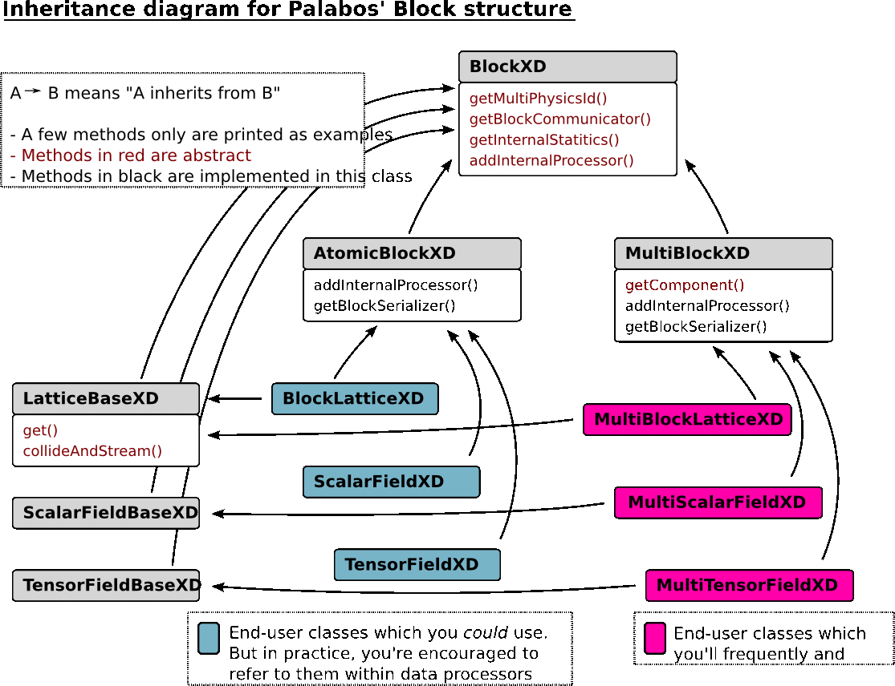
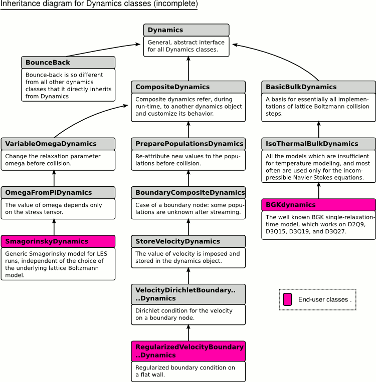

# Fundamental data types<div id="FundamentalDataTypes"></div>
## The `BlockXD` data structures
The fundamental data structures which hold the variables of a simulation are of type `Block2D` for 2D simulations, and of type `Block3D` for simulation (in the following, we use the generic name `BlockXD` to keep the discussion short, although there exists no type `BlockXD` in Palabos). From the standpoint of a user, a `BlockXD` construct represents a regular 2D or 3D array (or matrix) of data. Behind the scenes, they are sometimes really implemented as regular arrays and sometimes as more complicated constructs, which allows for example memory savings through sparse memory implementations, or parallel program executions based on a data-parallel model.

The `BlockXD` structures are specializes for different areas of application. One type of specializations is used to specify the type of data stored in the blocks. To store the particle populations of a lattice Boltzmann simulation, and potentially other variables such as external forces, you’ll use a specialization in which the name Block is replaced by `BlockLattice`. To store a spatially extended scalar variable, the data type to use is a variant of the `ScalarFieldXD`, whereas vector- or tensor-valued fields are stored in a `TensorFieldXD` or similar. A second type of specialization is applied to specify the nature of the underlying data structure. The `AtomicBlockXD` data structure stands essentially for a regular data array, whereas the `MultiBlockXD` is a complex construct in which the space corresponding to a `BlockXD` is partially or entirely covered by smaller blocks of type `AtomicBlockXD`. The `MultiBlockXD` and the `AtomicBlockXD` have practically the same user interface, and you are urged to systematically use the more general `MultiBlockXD` in end-user applications. It is almost as efficient as the `AtomicBlockXD` for regular problems, it can be used to represent irregular domains, and it is automatically parallelizable.

The following figure illustrates the C++ inheritance hierarchy between the various specializations of the `BlockXD` :



The figure shows, as an example, a few functions implemented at each level of the inheritance hierarchy. For example, all blocks of type “block-lattice” have a method `collideAndStream()`, no matter if they are implemented as a multi-block or an atomic-block. In the same way, all multi-blocks have a method `getComponent()`, no matter if they are of type block-lattice, scalar-field, or tensor-field. The situation shown on this figure is referred to as “multiple inheritance”, because end-user classes inherit from BlockXD in two ways: once through the atomic- vs. multi-block path, and once through the block-lattice vs. scalar- vs. tensor-field path. Note that multiple inheritance is often considered as bad practice because it can lead to error-prone code; in the present case however, we’ve had positive experiences so far with the inheritance diagram shown above, because it is easy to use and represents the two facets of a `BlockXD` in a natural way.

## Lattice descriptors
All `BlockXD` constructs are templatized with respect to the underlying data type. In practice, this feature is used to switch between single-precision and double-precision arithmetics by changing just one word in the end-user program:

```C++
// Construct a 100x100 scalar-field with double-precision floating point values.
MultiScalarField2D<double> a(100,100);
// Construct a 100x100 scalar-field with single-precision floating point values.
MultiScalarField2D<float> b(100,100);
```

Block-lattices additionally have a template parameter, the lattice descriptor, which specifies a few topological properties of the lattice (the number of particle populations, the discrete velocities, the weights of the directions, and other lattice constants). It is therefore easy to try out different lattices in an application:

```C++
// Construct a 100x100 block-lattice using the D3Q19 structure.
MultiBlockLattice2D<double, D3Q19Descriptor> lattice1(100,100);
// Construct a 100x100 block-lattice using the D3Q27 structure.
MultiBlockLattice2D<double, D3Q27Descriptor> lattice2(100,100);
```

It is also easy to write a new lattice descriptor (this is currently not documented, but you can check out the files in the directory `src/latticeBoltzmann/nearestNeighborLattices2D.h` to see how it works). This is extremely useful, because it means that you don’t need to re-write the lengthy code parts for the implementation of a BlockLatticeXD when you switch to a new type of lattice. This argument is part of a general concept described in the section [Non-intrusive program development with Palabos](Programming.md/#NIntrusive).

## The dynamics classes
During a time iteration of a lattice Boltzmann simulation, all cells of a block-lattice perform a local collision step, followed by a streaming step. The streaming step is hardcoded and can be influenced only by defining the discrete velocities in a lattice descriptor. The collision step on the other hand can be fully customized and can be different from one cell to another. In this way, the nature of the physics simulated on the lattice can be adjusted locally, and specific areas such as the boundaries can get an individual treatment.

Each cell of a block-lattice holds, additionally to the variables of the simulation, a pointer to an object of type `Dynamics`. This object provides most notably an implementation of the collision step. Additionally, it provides a means of computing the macroscopic variables, information for rescaling variables between grids of different size, and more model-dependent information. As a result, the list of methods declared in the class `Dynamics` is quite long, and it can seem tedious to inherit from this class. For this reason, Palabos provides a long list of classes inheriting from `Dynamics`, in which many methods are pre-defined for a specific purpose. Defining a new dynamics class therefore essentially consists in choosing the right place in the inheritance hierarchy and then overriding two or three methods. For the sake of illustration, a part of this inheritance diagram is printed in the following picture:



To learn how to define a new dynamics class, it is easiest to look at one of the classes defined in Palabos. For example, the BGK dynamics is defined in the file `src/basicDynamics/isoThermalDynamics.hh`. A good example for composite dynamics (a class which modifies the behavior of another, existing dynamics class) is the Smagorinsky dynamics, defined in `src/complexDynamics/smagorinskyDynamics.hh`.

For the implementation of the collision, the dynamics object gets a reference to a single cell; the collision step is therefore necessarily local. Non-local ingredients of a simulation are implemented with data processors, as shown in the next section.

Like the block-lattice, a dynamics object is dependent on two template parameters, one for the floating-point representation, and one for the lattice descriptor. By using the information provided in the lattice descriptor, the collision step should be written in a generic, lattice-independent way. There is obviously an efficiency trade-off in writing the algorithms in a generic way, because it is possible to formulate optimizations for specific lattices which the compiler fails to find. This problem can be circumvented by using template specializations for a given lattice. As an example, take again the implementation of the class `BGKdynamics`. The implementation of collision step refers to a generic object `dynamicsTemplates`, which is defined in the file `src/latticeBoltzmann/dynamicsTemplates.h`. Efficient specializations of this class for various 2D and 3D lattices are found in the files `dynamicsTemplates2D.h` and `dynamicsTemplates3D.h`.

## Data processors
Data processors define an operation to be performed on the entire domain, or on parts of a block. On a block-lattice, they are used to implement all operation which cannot be formulated in terms of dynamics objects. These consist most notably of non-local operations, such as the evaluation of finite difference stencils for the implementation of boundary conditions. On scalar-fields and tensor-fields, data processors provide the only (sufficiently efficient and parallelizable) way to perform an operation on a spatially extended domain.

Furthermore, data processors have the ability to exchange information between several blocks, either of the same type or of different type (example: coupling between a block-lattice and scalar-field). This is for example used for the implementation of physical couplings (multi-component fluids, thermal fluids with Boussinesq approximation), for the setup of initial conditions (initialization of the velocity from the values in a vector-field), or the execution of classical array-based operations (element-wise addition of two scalar-fields).

Finally, data processors are used to perform reduction operations, on the entire block or on sub-domains. Examples range from the computation of the average kinetic energy in a simulation to the computation of the drag force acting on an obstacle.

Two different point of views are adopted for the definition and for the application of a data processor. At the application level, the user specifies an area (which can be rectangular or irregular) of a given block, on which to execute the data processor. If the block has internally a multi-block structure, the data processor is subdivided into several more specific data processors, one for each atomic-block inside the multi-block which intersects with the specified area. At the execution level, a data processor therefore always acts on an atomic-block, on an area which was previously determined by intersecting the original area with the domain of the atomic-block.

It should be mentioned that while the raw data processors are somewhat awkward to use, you are likely to never be in contact with them. Instead, Palabos offers a simplified interface through so-called data-processing functionals, which hide technical details and let you concentrate on the essential parts. The rest of the user guides concentrates exclusively on these functionals, which will be called data processors for short.

In the end, it is quite easy to define new data processors. All you need to do is write a function which receives an atomic-block and the coordinates of a sub-domain as parameters, and executes an algorithm on this sub-domain. All complex operations, like the sub-division of the operations in presence of a multi-block, or the parallelization of the code, are automatic.

An educative example of a data processor is found in the example file `examples/codeByTopics/couplings`. It shows how to initialize a block-lattice with a velocity from a vector field by writing a data processor for block-lattice vs. 2D tensor-field coupling.

More definitions of data-processors acting on block-lattices can be found in the files `src/simulationSetup/latticeInitializerXD.h` and `.hh`, and data-processors acting on scalar- or tensor-fields are defined in the files `src/simulationSetup/dataFieldInitializerXD.h` and `.hh`. Examples for the evaluation of reduction operations are provided in the files `src/core/dataAnalysisXD.h` and `.hh`.

All these data-processors are wrapped up in convenience functions, which are summarized in the [Appendix: partial function/class reference](PartialFunctionClassReference.md/#PFCR).