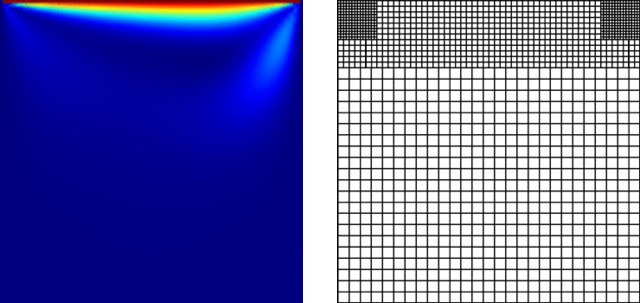
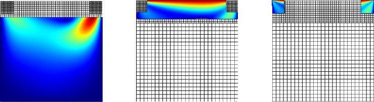
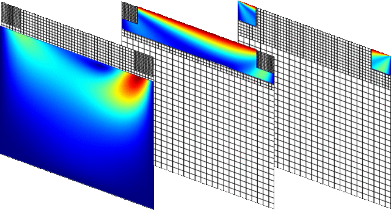

# Grid refinement

## Overview
Since Version 0.7, Palabos offers the possibility to work with refined grid. At this point, only 2D grid refinement is implemented. As for the other aspects of Palabos, grid refinement is orthogonal to other implemented concepts. This means for example that previously implemented dynamics objects and data processors work also with a refined grid. Furthermore, refined grids can be parallelized in a general way (the boundaries between the domains on different processes can be chosen without restrictions).

## Multi-layer grid refinement
Grid refinement in Palabos is an extension of the multi-block concept, and is referred to as “multi-grid”. Every level of grid refinement is covered by a certain number of blocks and is represented by a multi-block. The full grid - the “multi-grid” - is consituted by a superposition of all these levels.

Take as an example the 2D lid-driven cavity, represented by three levels of refined grids, to increase the accuracy near the top lid, and in particular near the top left and top right corners:

Here’s the trick: Palabos simply generates for you three separate multi-blocks, each of which holds the data at a certain level of grid refinement. The multi-blocks have a sparse memory representation, which means that the whole manoeuvre does not cost anything in terms of memory and efficiency. In our case, there are three multi-blocks, as suggested in the image below. The left-most multi-block is the smallest once, because it holds the data at the coarsest level, and the right-most the biggest one, standing for the finest level.

Palabos then gathers the three multi-blocks into a single data structure (but, for convenience, you can still access them individually), called “multi-grid” structure:

## Interactive creation of a multi-grid
The usage of the multi-grid data structure is illustrated by the example program `showCases/gridRefinement2d`.